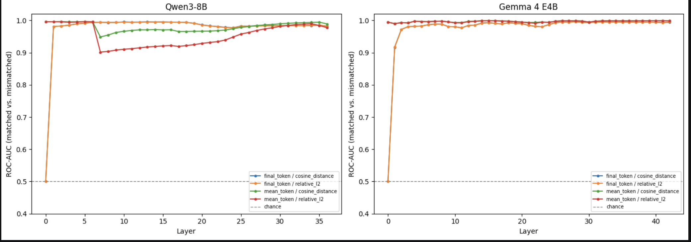
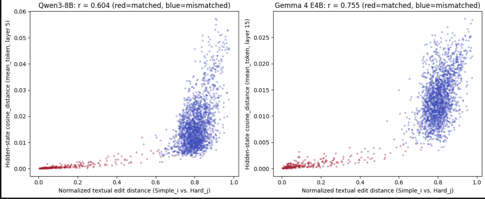

# Addendum: Interpreting Matched-vs-Mismatched Hidden-State ROC-AUC

## What is being compared?

For each model layer, we compare two types of Simple-Hard prompt pairs:

- **Matched pairs:** the Simple and Hard versions of the same original mathematics problem.
- **Mismatched pairs:** a Simple prompt from one problem paired with a Hard prompt from a different problem.

For each pair, we compute a hidden-state distance. Smaller distances mean that the two prompt representations are more similar.

## Reading the plot labels

Here is what every label means.

- **Left panel: “Qwen3-8B”**  
  Results from the Qwen3-8B model.

- **Right panel: “Gemma 4 E4B”**  
  Results from the Gemma 4 E4B model.

- **X-axis: “Layer”**  
  The model processes a prompt through many stages called layers. Layer 0 is near the beginning; later layer numbers are deeper in the model.

- **Y-axis: “ROC-AUC (matched vs. mismatched)”**  
  This measures how well hidden-state distance at that layer separates matched pairs—Simple and Hard from the same original problem—from mismatched pairs—Simple from one problem and Hard from another. A value near 1.0 means matched pairs almost always have smaller hidden-state distance. A value of 0.5 means no useful separation.

- **Gray dashed line: “chance”**  
  The 0.5 baseline. A method on this line is no better than guessing.

The colors show four different ways of calculating the hidden-state distance:

## Four ways of making the comparison

- **Blue:** “Using cosine distance and only the final token at this layer, how well can we separate matched from mismatched pairs?”

- **Orange:** “Using relative L2 distance and only the final token at this layer, how well can we separate matched from mismatched pairs?”

- **Green:** “Using cosine distance after averaging all prompt tokens at this layer, how well can we separate matched from mismatched pairs?”

- **Red:** “Using relative L2 distance after averaging all prompt tokens at this layer, how well can we separate matched from mismatched pairs?”

## ROC-AUC definition

ROC-AUC measures how likely it is that a randomly selected matched pair has a smaller hidden-state distance than a randomly selected mismatched pair.

An ROC-AUC of 0.5 means that the distances do not distinguish matched from mismatched pairs. An ROC-AUC close to 1.0 means that matched pairs almost always have smaller hidden-state distances than mismatched pairs.

## How ROC-AUC is computed

It is computed by comparing every matched-pair distance with every mismatched-pair distance.

For each comparison:

- Give a point if the matched pair has the smaller distance.
- Give half a point if the distances tie.
- Give zero if the mismatched pair has the smaller distance.

Then:

$$
\text{ROC-AUC} =
\frac{\text{total points}}{
(\text{number of matched pairs}) \times
(\text{number of mismatched pairs})
}
$$

For example, with 279 matched pairs and 2,000 mismatched pairs, it makes:

$$
279 \times 2000 = 558{,}000
$$

comparisons. If the matched pair is closer in 556,000 of them, the AUC is about \(556{,}000 / 558{,}000 = 0.996\).

## Strongest matched-versus-mismatched separation

| Model | Best position | Layer | Metric | ROC-AUC | Matched mean (median) | Mismatched mean (median) |
| --- | --- | ---: | --- | ---: | ---: | ---: |
| Qwen3-8B | Mean token | 5 | Cosine distance | 0.9964 | 0.0010 (0.0004) | 0.0166 (0.0145) |
| Gemma 4 E4B | Mean token | 15 | Cosine distance | 0.9993 | 0.0009 (0.0005) | 0.0136 (0.0130) |

Each model used 279 matched pairs and 2,000 mismatched pairs.

For both models, the Simple and Hard versions of the same math problem had much more similar internal representations than two unrelated problems. This was true at almost every layer and with every way of measuring similarity.

The clearest difference appeared when we averaged information from every word in the prompt:

- In Qwen, this was strongest at layer 5.
- In Gemma, this was strongest at layer 15.

In both models, the same-problem pairs were about 15-16 times closer together internally than unrelated pairs.

The strongest matched-versus-mismatched separation was obtained using cosine distance between mean-pooled prompt-token hidden states. For Qwen3-8B, this occurred at layer 5 (ROC-AUC = 0.9964): the 279 matched Simple-Hard pairs had a mean cosine distance of 0.0010 (median = 0.0004), compared with 0.0166 (median = 0.0145) across 2,000 mismatched pairs. For Gemma 4 E4B, the strongest separation occurred at layer 15 (ROC-AUC = 0.9993): matched pairs had a mean cosine distance of 0.0009 (median = 0.0005), compared with 0.0136 (median = 0.0130) for mismatched pairs. Thus, at these layers, matched prompt pairs occupied substantially more similar mean-pooled hidden-state representations than unrelated prompt pairs.

However, the matched problems also used more similar wording. At this stage, this shows that the models’ internal states track similarity in the prompts.

## Relationship between text difference and hidden-state difference

This figure provides clear visual evidence that text similarity is a major confound in the matched-versus-mismatched comparison.

Each dot represents one Simple-Hard comparison:

- **X-axis:** how different the two prompts are in wording.
- **Y-axis:** how different their hidden states are.
- **Red dots:** real matched pairs.
- **Blue dots:** mismatched, unrelated pairs.

The pattern slopes upward: pairs with more different text generally also have more different hidden states. The correlation is \(r = 0.604\) for Qwen3-8B and \(r = 0.755\) for Gemma 4 E4B.

Matched pairs cluster in the lower-left, meaning they have both similar wording and similar hidden states. Mismatched pairs cluster farther up and to the right, meaning they have more different wording and more different hidden states.

## Attempted text-matched control

To test whether hidden states distinguish matched pairs for a reason beyond shared wording, we attempted to create unrelated Simple-Hard control pairs with textual edit distances similar to those of the true matched pairs. A valid text-matched control would have a control edit-distance distribution close to the matched-pair distribution, and text alone should then give an AUC near 0.5.

| Model | Matched mean edit distance | Control mean edit distance | Text-only sanity AUC | Hidden-state AUC on attempted control |
| --- | ---: | ---: | ---: | ---: |
| Qwen3-8B | 0.1497 | 0.6196 | 0.9733 | 0.9692 |
| Gemma 4 E4B | 0.1497 | 0.6196 | 0.9733 | 0.9821 |

The attempted control was not text-matched: its mean edit distance was more than four times larger than that of the true matched pairs, and text alone still separated the two groups with an AUC of 0.9733. Consequently, the high hidden-state AUCs in this comparison cannot be interpreted as evidence that hidden states distinguish the pairs beyond wording. Instead, this result shows that genuinely text-matched unrelated controls are not available in this dataset.

## What happens after removing the hidden-state difference predicted by text?

This analysis asks: when trying to remove the hidden-state difference that can be predicted from how different the two prompts’ text is, what do we find?

It removes the text-predicted part of each pair’s distance, whether the pair is matched or mismatched.

| Model | Regression of hidden-state distance on edit distance | Full AUC | Residual-only AUC | Correlation between residual and matched label |
| --- | --- | ---: | ---: | ---: |
| Qwen3-8B | `hidden_dist ~ 0.0260 * edit_dist - 0.0042` | 0.9964 | 0.3437 | 0.0642 |
| Gemma 4 E4B | `hidden_dist ~ 0.0195 * edit_dist - 0.0021` | 0.9993 | 0.4544 | 0.0133 |

### Findings

- Most of the original hidden-state difference can be explained by text edit distance.
- After removing that text-related part, there is only a small and unclear leftover difference between matched and mismatched pairs.
- For Gemma, the leftover is almost no better than chance.
- For Qwen, there may be a modest leftover pattern, but it points in the opposite direction from the notebook’s original assumption and needs better testing.

So the main result is: wording explains most of the effect; this test does not find strong evidence that hidden states add a large extra signal beyond wording.

## Limitation: mismatched-pair sampling

Mismatched-pair sampling. The analysis used 2,000 randomly sampled mismatched pairs rather than all 77,562 possible mismatched Simple-Hard pairings. Although the observed separation was large, the reported AUC values may depend slightly on the particular random sample selected. Future work should repeat the analysis across multiple random seeds or evaluate all possible mismatched pairs to quantify this sampling uncertainty.
